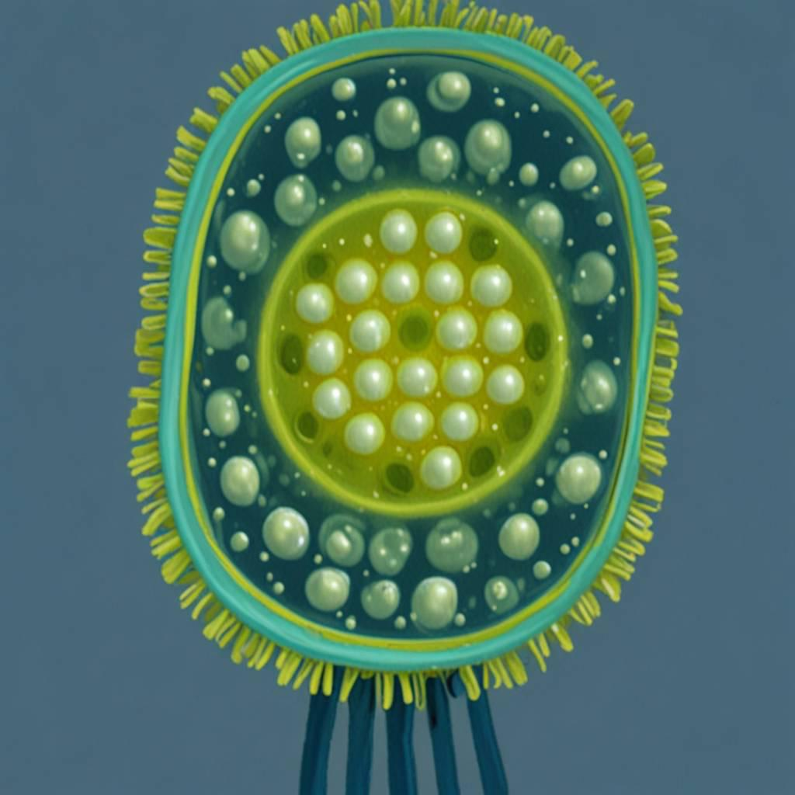

# Chemosynthesis Challenge: A NASA Hackathon Project

## Table of Contents
- [Project Overview](#project-overview)
- [Objectives](#objectives)
- [Game Description](#game-description)
- [Key Features](#key-features)
- [Technologies Used](#technologies-used)
- [How to Run the Project](#how-to-run-the-project)
- [Contributing](#contributing)
- [Team Members](#team-members)
- [Contact Information](#contact-information)



## Project Overview
The **Chemosynthesis Challenge** is an educational game developed for a NASA hackathon, designed to explore the potential of non-photosynthetic organisms and their interactions in various chemical environments. This project aims to teach players about the chemistry underlying these hypothetical ecosystems and illustrate how such organisms might coexist and thrive.

## Objectives
- Demonstrate the feasibility of non-photosynthetic life forms in diverse environments.
- Educate users on the principles of chemosynthesis and its implications for extraterrestrial life.
- Provide an engaging platform for players to experiment with and understand chemical interactions.

## Game Description
The game simulates a dynamic ecosystem populated by various non-existent organisms that rely on chemosynthesis for survival. Players can:
- Create and manage unique organisms, each with distinct attributes influenced by their chemical environment.
- Explore how these organisms interact with each other and adapt to changing conditions.
- Learn about the chemical processes that enable these life forms to thrive in environments devoid of sunlight.

## Key Features
- **Dynamic Ecosystem:** Organisms with unique behaviors, attributes, and interactions based on their chemical composition.
- **Interactive Learning:** Engaging gameplay that incorporates educational content on chemosynthesis and chemical interactions.
- **Visual Representation:** A grid-based interface showcasing organisms, their growth, and interactions in a visually appealing manner.
- **Python & Pygame Integration:** Built entirely in Python using the Pygame library for smooth graphics and gameplay.

## Technologies Used
- **Python:** The primary programming language for the project.
- **Pygame:** A set of Python modules designed for writing video games, providing functionalities for graphics, sound, and game mechanics.
- **JSON:** Used for data storage and retrieval of organism attributes and behaviors.

## How to Run the Project
1. Clone the repository:
   ```bash
   git clone https://github.com/yourusername/ChemosynthesisChallenge.git

2. Navigate to the project directory:
   ```bash
    cd ChemosynthesisChallenge

3. Install the required dependencies:
   ```bash
    pip install pygame

4. Run the game:
   ```bash
    python main.py

## Contributing

We encourage contributions to improve the game! If you have ideas or want to make changes, you can follow these steps:

Fork the repository: This creates a copy of the project on your GitHub account where you can make changes.
Create a new branch: This allows you to isolate your changes without affecting the main project codebase.
Implement your changes and commit them: Make your improvements to the code and save them using Git commands.
Submit a pull request: Share your changes with the project maintainers for review and potential inclusion in the main code.

## Team Members

For any questions or further information about the project, feel free to contact the team members at:

Nicolás David Orjuela Sánchez - [your_email@example.com]
[Team Member 2 Email]
[Team Member 3 Email]
[Team Member 4 Email]
